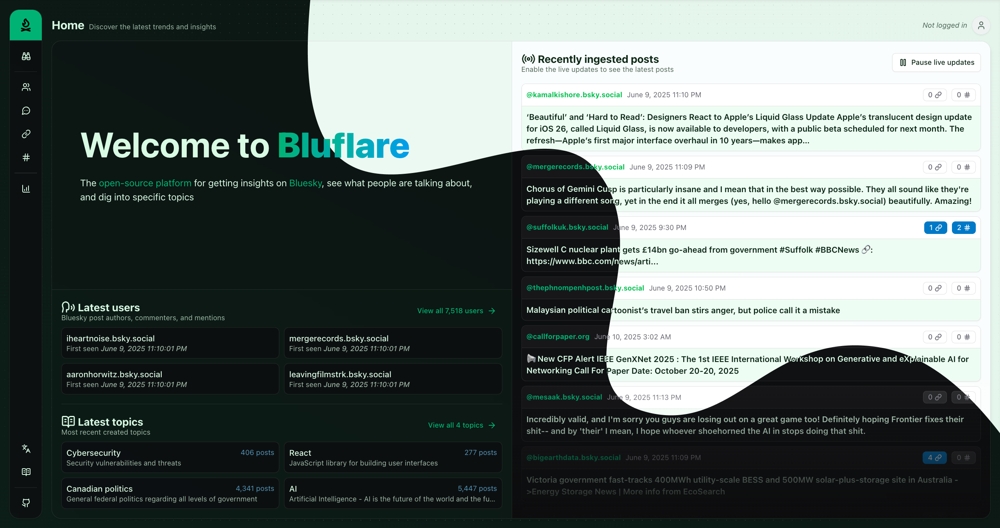

#  Bluflare

[](https://github.com/BenJeau/bluflare/pkgs/container/bluflare%2Fbackend) [](https://github.com/BenJeau/bluflare/actions/workflows/rust_check.yml)
[](https://github.com/BenJeau/bluflare/actions/workflows/react_check.yml)
[](https://github.com/BenJeau/bluflare/actions/workflows/rust_fmt.yml)
[](https://github.com/BenJeau/bluflare/actions/workflows/react_fmt.yml)

Monitor [Bluesky](https://bsky.app) posts and analyze trends in real-time.

> Powered by the [Bluesky Firehose](https://docs.bsky.app/docs/advanced-guides/firehose) via their [Jetstream](https://github.com/bluesky-social/jetstream) websocket service using [Rust](https://www.rust-lang.org/) with a [React](https://react.dev/) frontend.



## Features

- Track and filter Bluesky posts based on custom keywords
- Real-time monitoring of the Bluesky Firehose
- View and manage interests/keywords
- Analyze and summarize posts matching your interests
- Sentiment analysis of posts

## Getting Started

### Prerequisites

- Rust (latest stable version)
- Node.js (latest LTS version)
- pnpm
- SQLite

### Running the Application

1. Clone the repository:

```bash
git clone https://github.com/BenJeau/bluflare.git
cd bluflare
```

2. Start the backend:

```bash
cd backend
cargo run --bin backend
```

3. Start the frontend:

```bash
cd frontend
pnpm install
pnpm dev
```

The frontend will be available at `http://localhost:5173` by default and the backend at `http://localhost:3000`.

### Development

The backend is built with:

- API Framework: [Axum](https://github.com/tokio-rs/axum)
- Database: [SQLx](https://github.com/launchbadge/sqlx) + [SQLite](https://www.sqlite.org/index.html)
- Websocket client: [Jetstream](https://github.com/bluesky-social/jetstream)
- Logging: [tracing](https://github.com/tokio-rs/tracing)

The frontend is built with:

- Illustrations: [Manypixels](https://www.manypixels.co/gallery)
- Icons: [Lucide](https://lucide.dev/)
- Styling: [TailwindCSS](https://tailwindcss.com/)
- UI Framework: [shadcn/ui](https://ui.shadcn.com/)
- API Framework: [Tanstack Query](https://tanstack.com/query/latest)
- Routing: [Tanstack Router](https://tanstack.com/router/latest)
- State Management: [Jotai](https://jotai.org/)

## Deployment

Please refer to the [deployment documentation](./deploy/README.md) for more information to deploy to DigitalOcean.

## Project Structure

```
bluflare/
├── backend/           # Rust backend
│   ├── src/          # Source code
│   └── Cargo.toml    # Rust dependencies
├── frontend/         # React frontend
│   ├── src/          # Source code
│   └── package.json  # Node.js dependencies
└── README.md         # This file
```

## Contributing

Contributions are welcome! Please feel free to submit a Pull Request.

## License

This project is licensed under the MIT License - see the LICENSE file for details.
